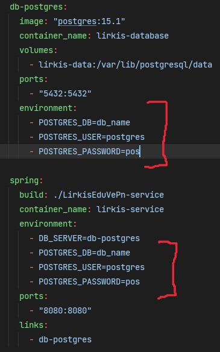

# LirkisEduVePn

## Getting started

Here you can find all necessary installations and configurations to set up and run project

## Installations

In order to start the project, you first need to install all the necessary tools that will be used:
* <font size="5" color="green">**Node.js**</font> (An environment that will be used as the development of a web application, and which contains the necessary JavaScript libraries)
  <br/>
  <font size="3" color="orange">**Download**</font>: https://nodejs.org/en/download


* <font size="5" color="green">**Docker**</font> (Software platform that allows you to build, test, and deploy applications quickly)
  <br/>
  <font size="3" color="orange">**Download**</font>: https://www.docker.com/products/docker-desktop/


* <font size="5" color="green">**Java Runtime Environment**</font> (The minimum virtual machine implementation required to run Java applications)
  <br/>
  <font size="3" color="orange">**Download**</font>: https://www.oracle.com/java/technologies/downloads/
  <br/>
  <font size="3" color="orange">**Preferences**</font>:
  The project is written on the 17th version of Java. Therefore, it is preferable to install


* <font size="5" color="green">**Java Runtime Environment**</font> (The minimum virtual machine implementation required to run Java applications)
  <br/>
  <font size="3" color="orange">**Download**</font>: https://www.oracle.com/java/technologies/downloads/


* <font size="5" color="green">**PostgreSQL**</font> (Database used in our project)
  <br/>
  <font size="3" color="orange">**Download**</font>: https://www.postgresql.org/download/

## Project setup


In order to run the project, you must have all the above tools, as well as configure the database locally and then change the configuration of the docker.compose.yaml file.

### Database setup

After you have installed PostgreSQL, create a local empty database in the terminal (psql) or desktop application (pgAdmin) provided by PostgreSQL during installation.

### Docker setup

After you have created a local database, you need to configure this database in the docker-compose.yaml file. You can find this file in the root path of the project.




In the photo you can see a partial configuration of the docker-compose.yaml file. The places marked in red need to be changed. Instead of <u>**POSTGRES_DB**</u>, you need to put the name of your local database that you created in the last paragraph. The <u>**POSTGRES_USER**</u> and <u>**POSTGRES_PASSWORD**</u> variables represent your username and password from your previously installed PostgreSQL. They also need to be changed.

### Optional

If necessary, you can change the configurations you need in the docker-compose.yaml file, as well as the Dockerfile inside each of the modules, for example, the ports on which the running modules will run and other settings

## Project run

In order to run an entire project, you need to run the following command in the root path of this project:
```
docker compose up --build
```
The command "docker compose up --build" is used to start and run a multi-container Docker application defined in a Compose file (typically named "docker-compose.yml"). The "--build" flag is used to rebuild any images defined in the Compose file, ensuring that the latest changes to the application are reflected in the running containers.

The Compose file is a YAML file that defines the services, networks, and volumes for the application, as well as any environment variables and other configuration options. Each service defined in the Compose file corresponds to a container that will be created and run.
Each service will have its own Dockerfile which describes the steps to build the image of that container.

This command will use the definition in the yaml file to start, stop and rebuild the defined containers.